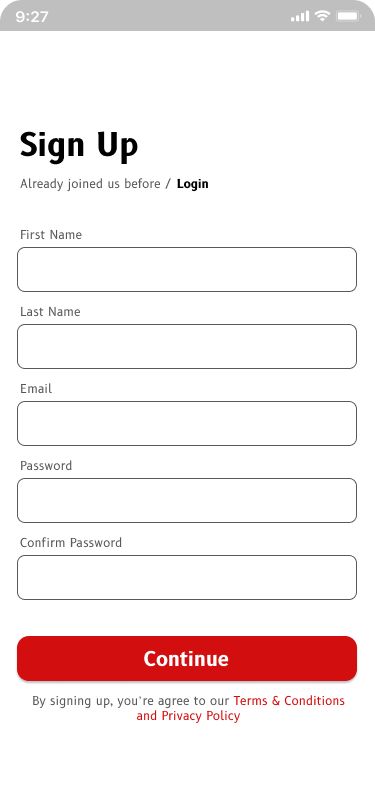
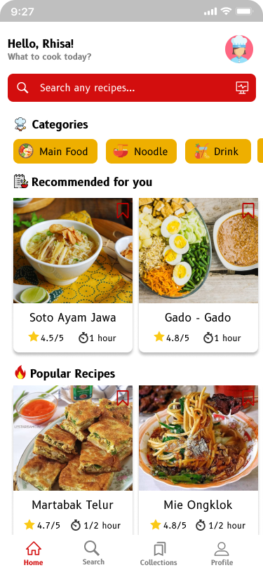
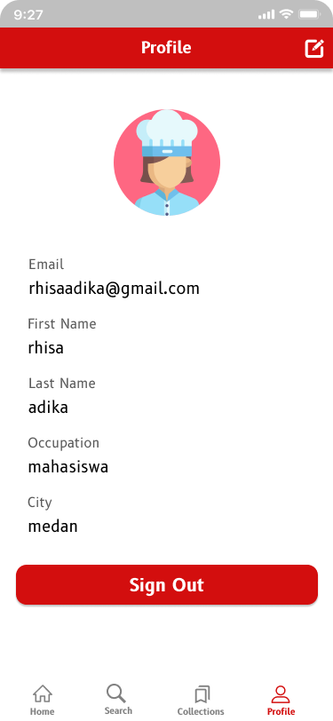
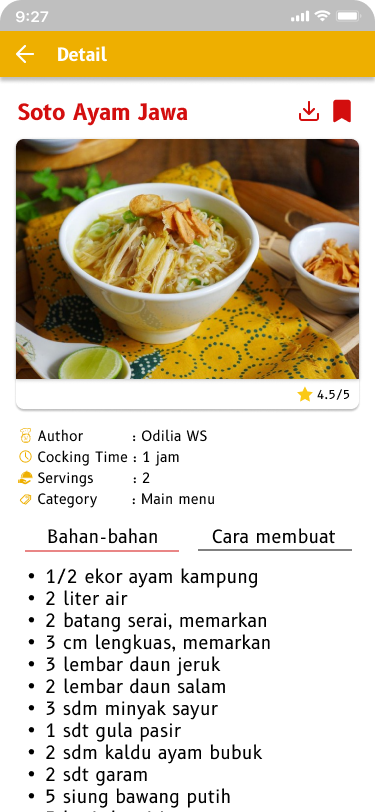
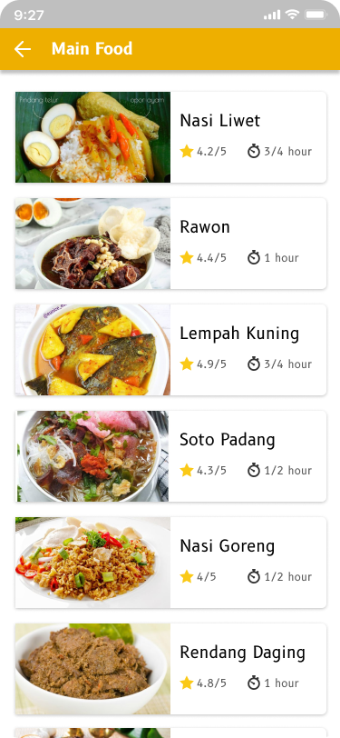
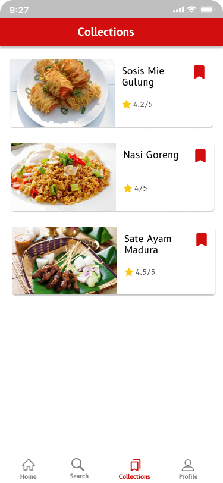
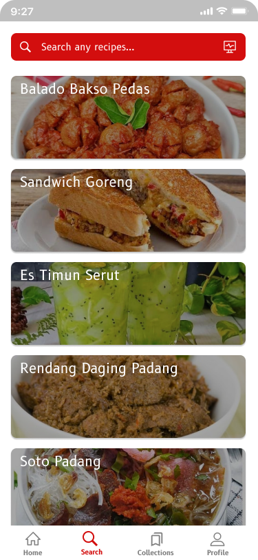

# ResepEmak Design 

Make an recipe application using Flutter and Dart Programming Language

## Feature
 
This application aims to make it easier for mobile users to see food recipe

## Package used in

- firebase-bom : 29.0.1
- firebase-auth : 21.0.1
- firebase-core : 20.0.1
- play-services-auth : 19.2.0
- facebook-android-sdk : [4,5)
- glide : 4.9.0
- gson : 2.8.7

## Some app screenshots 
 
### SplashScreen

### LoginPage

### SignUpPage

### HomePage

### ProfilePage

### DetailResep

### DetailCategories

### Collections

### Search

### Profile

